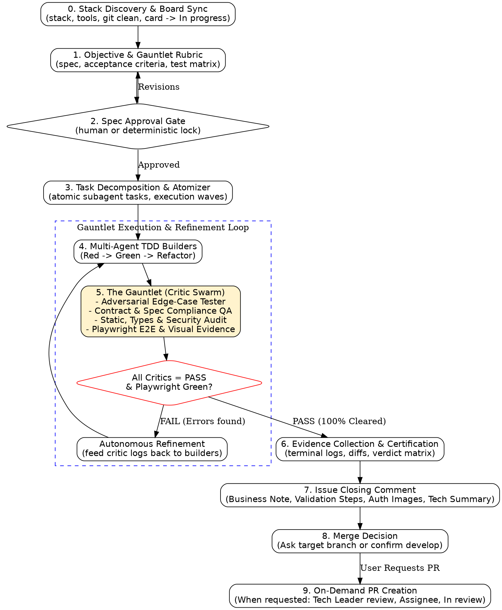

# MMC Gauntlet SDD

> **Lema:** O modelo propoe. O harness decide. O Gauntlet verifica. O log de eventos prova.

---

## 1. Visao Geral e Arquitetura

O **MMC Gauntlet SDD** evolui o framework deterministico de *Spec-Driven Development* integrando o padrao agentico **Gauntlet Loop**, a esteira Playwright de testes E2E com evidencias visuais e a gestao automatizada do ciclo de vida no GitHub Projects v2.

Enquanto o SDD estabelece especificacoes, invariantes e portoes de qualidade formais, o **Gauntlet Loop** atua como motor de execucao autonoma multi-agente onde **Subagentes Construtores (Builders)** implementam o codigo via TDD e **Subagentes Criticos Adversariais (The Gauntlet)** submetem a solucao a uma bateria rigorosa de testes unitarios, testes de integracao, auditoria de contratos, analise estatica e testes ponta a ponta (E2E) com capturas de tela comprobatorias.



---

## 2. Hard Invariants (As Regras Nao-Negociaveis)

1. **Sem Codigo Sem Spec e Rubrica:** Nunca escreva, modifique ou delete codigo de producao sem antes formalizar a Spec do Objetivo e a Rubrica de Avaliacao do Gauntlet (`docs/specs/YYYY-MM-DD-<topic>-spec.md`).
2. **Evidencia sobre Assercao:** Jamais declare uma tarefa como pronta ou funcionando sem executar os comandos reais no terminal e anexar a saida literal dos logs e saidas de status (`Exit Code: 0`).
3. **Aprovacao Unanime do Gauntlet e Playwright:** Uma entrega so e concluida se passar com status `PASS` por todos os criticos do Gauntlet (Adversarial, Contrato, Estatico) e obtiver execucao 100% verde nos testes Playwright E2E (`npm run test:e2e`).
4. **Integridade Imutavel de Testes (Anti-Cheat):** E estritamente proibido aos Builders enfraquecer, comentar ou alterar assercoes de testes existentes para forcar um status verde. Qualquer mudanca de contrato exige aprovacao formal.
5. **Travas de Seguranca (Circuit Breakers):** O loop autonomo possui um limite estrito de 5 iteracoes. Se atingir o limite sem aprovacao, o harness pausa imediatamente e solicita intervencao humana via diagnostico.
6. **Arvore Git Limpa e GitFlow Rigoroso:** A branch base de desenvolvimento e a `develop`. Branches de trabalho seguem a convencao `marcos/<task-id>/<titulo-curto-kebab>`. Commits seguem `<type>: #<task-id> <descricao em pt-BR>` (ex.: `feat: #45 adiciona validacao de cnpj`). Nunca commitar diretamente em `main` ou `staging`.
7. **Proibicao Estrita de Emojis, Emoticons e Icones Graficos:** Issues, comentarios em issues, commits, Pull Requests e relatorios de certificacao NAO podem, sob nenhuma hipotese, conter emojis ou icones graficos quaisquer. Utilize exclusivamente texto estruturado em Markdown.
8. **Padrao de Evidencias Visuais com Screenshots Autenticadas:** Playwright configurado com `screenshot: 'on'` globalmente. Screenshots de sucesso e etapas-chave devem ser salvas em `tests/evidence/<issue-id>/` e incorporadas via tags HTML apontando para o blob autenticado do repositorio: `/tests/evidence/<issue-id>/<arquivo>.png?raw=true" alt="<descricao>" width="100%" />`. Nunca utilize links `raw.githubusercontent.com`.
9. **Sincronizacao Obrigatoria com o Board do GitHub Projects:** Cards seguem rigorosamente as 9 colunas oficiais. Ao iniciar `/mmc-gauntlet-sdd` com URL de issue ou card, mover imediatamente para `In progress`.
10. **Comentario Obrigatorio de Encerramento na Issue:** Logo apos a conclusao do Gauntlet, publicar comentario na issue contendo:
    * Nota para o Time de Negocios em linguagem nao tecnica sobre o que foi resolvido e o impacto operacional.
    * Roteiro passo a passo de validacao operacional.
    * Screenshots incorporadas via tags HTML autenticadas.
    * Resumo tecnico e matriz de testes aprovados.
11. **Pergunta de Destino de Merge:** Se uma branch foi criada para a issue, ao final do desenvolvimento o agente DEVE perguntar ao usuario para onde ela deve ser mergeada. Se ja foi commitado direto na `develop`, deixar isso explicitamente informado.
12. **Pull Requests Exclusivamente Sob Demanda:** NAO abrir PR automaticamente por issue/task. O PR so deve ser aberto quando o usuario solicitar explicitamente. Ao abrir, incluir Tech Leader `@thiagobotelhorodoind` como revisor, `@marcos-rodoind` como assignee, status `In review` no board, referencias informativas `Ref #<id>` (sem usar `Closes #<id>`) e tags HTML de imagens no corpo.

---

## 3. Ciclo de Vida do Board no GitHub Projects (9 Colunas Oficiais)

O board do GitHub Projects v2 e governado pelo seguinte fluxo formal:

| Ordem | Coluna | Definicao Operacional |
| :---: | :--- | :--- |
| 1 | `Backlog` | Atividades criadas que estao liberadas apenas para o refinamento. |
| 2 | `Refinement` | Atividades em processo de refinamento tecnico e de negocios. |
| 3 | `Ready` | Atividades refinadas e prontas para atuacao do desenvolvedor no codigo. |
| 4 | `In progress` | Atividades em desenvolvimento ativo (disparo do `/mmc-gauntlet-sdd` ou criacao de branch). |
| 5 | `In review` | Atividades com avaliacao de Pull Request solicitada (da branch de feature para a `develop`). |
| 6 | `Await Staging` | Atividades com PR mergeado na `develop`, aguardando publicacao da `develop` para `staging`. Issues permanecem abertas. |
| 7 | `In Staging` | Atividades publicadas no ambiente de homologacao (`staging`) liberadas para validacao pelo QA/Homologador. |
| 8 | `Blocked` | Atividades com impedimento tecnico, negocial ou de dependencia externa, independente do estagio anterior. |
| 9 | `Done` | Atividades publicadas e entregues em Producao (apos merge de `staging` para `main` e release gerada). Fecha as issues. |

### Regras de Transicao Automatica e Manual:
* **Entrada de Issue:** Entra em `Backlog`.
* **Inicio do Desenvolvimento (`/mmc-gauntlet-sdd <url-issue>`):** O card e a issue sao movidos imediatamente para `In progress`.
* **Abertura de PR (`feature -> develop`):** PR e issues vinculadas sao movidos para `In review`.
* **Merge do PR em `develop`:** Issues vinculadas sao movidas para `Await Staging` (mantendo-se abertas).
* **Merge de `develop -> staging`:** Issues vinculadas sao movidas para `In Staging`.
* **Merge de `staging -> main`:** Issues vinculadas sao movidas para `Done` e fechadas.
* **Impedimento identificado:** Mover manualmente para `Blocked`.

---

## 4. The 7-Gate State Machine com Gauntlet

### Gate 0: Stack Profiling, Repositorio & Sincronizacao do Board
* Identifica stack, runtime, gerenciador de pacotes e suites de teste disponiveis (`vitest`, `playwright`, `pytest`, `cargo`, etc.).
* Valida a integridade da arvore de trabalho (`git status --porcelain`). Se houver modificacoes nao commitadas, alerta ou faz stash seguro.
* Se invocado com a URL de uma issue do GitHub ou card do Projects, move o status imediatamente para `In progress` no GitHub Projects.

### Gate 1: Objective Spec & Gauntlet Rubric Inception
Formaliza a especificacao executavel em `docs/specs/YYYY-MM-DD-<topic>-spec.md`:
* **Problem & Desired Outcome:** Contexto e resultado esperado mensuravel.
* **Scope Boundaries:** Limites estritos de In-Scope e Out-of-Scope (Non-Goals).
* **Acceptance Criteria:** Checklist objetivo (`[ ]`).
* **Gauntlet Rubric (Bateria de Prova de Fogo):**
  * *Testes Unitarios/Integracao*: suites deterministicas e cobertura minima esperada.
  * *Vetores Adversariais*: inputs nulos, tipos incorretos, valores de fronteira, concorrencia, resiliencia a falhas externas.
  * *Regras de Estilo, Tipos e Seguranca*: linters, typecheck estrito e checagem de vulnerabilidades.
  * *Suite E2E & Validacao Visual*: Playwright com geracao de screenshots em `tests/evidence/<issue-id>/`.

### Gate 2: Spec Approval Gate
* Bloqueio deterministico ou confirmacao humana antes de iniciar qualquer alteracao no codigo.
* A spec e congelada; alteracoes posteriores exigem justificativa formal.

### Gate 3: Task Decomposition & Atomization (`/mmc-gauntlet-sdd atomizer`)
* Decompoe a spec ou documento de requisitos bruto em tarefas atomicas isoladas por dominio/camada (`docs/tasks/TASK-NNN.md`).
* Cada tarefa contem:
  * **Guia TDD:** Arquivo de teste alvo para o ciclo RED, comando de execucao e implementacao minima GREEN.
  * **Task Gauntlet Rubric:** Vetores adversariais especificos que o Adversarial Critic cobrara.
* Gera o indice `docs/tasks/INDEX.md` organizado em **Ondas de Paralelismo** (Fundacao/Setup -> Dominio/Servicos -> APIs/Controllers -> Integracao/E2E).

### Gate 4: Multi-Agent TDD Builders
* O Orquestrador despacha Builder Subagents para as tarefas atomicas (em paralelo por ondas).
* Cada Builder segue estritamente o ciclo TDD:
  1. **RED:** Cria o teste unitario/integracao e comprova a falha no terminal.
  2. **GREEN:** Escreve o codigo minimo indispensavel para satisfazer o teste.
  3. **REFACTOR:** Limpa e otimiza sem quebrar a suite.

### Gate 5: The Gauntlet (Swarm de Critica Adversarial & Playwright E2E)
Assim que os Builders finalizam a implementacao, o harness submete o codigo a prova de fogo dos criticos independentes:
1. **Adversarial QA Critic:**
   * Injeta testes de estresse, inputs extremos, strings vazias, valores negativos e concorrencia.
2. **Contract & Spec Compliance QA Critic:**
   * Audita o diff contra a Spec e tarefas. Detecta diluicao de testes (anti-cheat) e quebra de contratos publicos.
3. **Static, Types & Security Critic:**
   * Roda linters (`npm run lint`), compilacao e typecheck estrito (`npm run typecheck`), alem de checagem de vulnerabilidades.
4. **E2E & Visual Critic (Playwright):**
   * Executa a suite ponta a ponta (`npm run test:e2e`).
   * Valida fluxos de tela e confirma a gravacao de screenshots em `tests/evidence/<issue-id>/`.

> **Veredito do Gauntlet:** Se algum critico reportar `FAIL` ou os testes E2E falharem, o relatorio de discrepancias retorna aos Builders para correcao. O ciclo itera ate `100% PASS` ou disparo do *Circuit Breaker*.

### Gate 6: Evidence Certification, Issue Registration & Hand-off
* **Evidence Bundle:** Consolida matriz de aprovacao do Gauntlet, logs integrais com `Exit Code: 0` e diffs limpos (`git diff --stat`).
* **Comentario de Encerramento na Issue:** Publica imediatamente na issue o comentario estruturado com:
  * Nota para o Time de Negocios (nao tecnica, impacto operacional).
  * Passo a Passo de Validacao.
  * Screenshots visiveis via tags HTML autenticadas (`/tests/evidence/<issue-id>/<arquivo>.png?raw=true" alt="<descricao>" width="100%" />`).
  * Resumo Tecnico e Matriz de Testes.
* **Pergunta de Destino de Merge:** Se a issue foi trabalhada em branch separada, pergunta ao usuario para onde deseja mergear. Se foi commitada direto em `develop`, declara explicitamente.
* **Pull Request Sob Demanda:** Caso o usuario solicite a abertura de PR, compila o PR conforme os requisitos mandatorios.

---

## 5. Matriz de Subagentes e Papeis

| Papel | Responsabilidade Principal | Ferramentas |
| :--- | :--- | :--- |
| **Orchestrator** | Gerencia os Gates, sincroniza o board GitHub Projects, controla limites do Gauntlet e emite os relatorios finais. | `view_file`, `invoke_subagent`, `run_command` |
| **Builder Subagent** | Implementa codigo de producao e testes via ciclo TDD para tarefas atomicas por ondas. | `write_to_file`, `replace_file_content`, `run_command` |
| **Adversarial Critic** | Cria cenarios extremos, bordas nao previstas e tenta ativamente quebrar a implementacao. | `run_command`, `view_file` |
| **Contract QA Critic** | Audita diffs contra a Spec, detecta adulteracao/diluicao de testes e garante retrocompatibilidade. | `view_file`, `run_command` |
| **Static & Security Critic** | Executa typecheckers estritos, linters estaticos e analisa vulnerabilidades de dependencias. | `run_command` |
| **E2E & Visual Critic** | Executa testes ponta a ponta via Playwright e valida a captura de evidencias visuais em `tests/evidence/<issue-id>/`. | `run_command`, `view_file` |

---

## 6. Circuit Breakers & Protecoes Anti-Drift

1. **Max Iterations (Limite de 5 Loops):** O loop autonomo executa no maximo 5 ciclos entre Builders e Critics. Se persistirem falhas, o harness pausa e emite diagnostico de causa-raiz via `/mmc-gauntlet-sdd doctor`.
2. **Spec Tamper Detection:** Qualquer modificacao nao autorizada na Spec congelada ou em testes pre-existentes dispara reversao automatica do commit.
3. **Regression Hard-Stop:** Se testes de modulos nao relacionados falharem, o harness aborta a tarefa e reverte o commit causador.
4. **Git Tree Cleanliness:** Nenhuma transicao para certificacao e aceita com arvore de trabalho suja ou arquivos nao rastreados.

---

## 7. Tabela de Racionalizacao & Red Flags

| Desculpa / Racionalizacao | Realidade Exigida pelo MMC Gauntlet SDD |
| :--- | :--- |
| *"Ja passei nos testes unitarios, nao preciso rodar o Playwright E2E."* | O Gauntlet e cumulativo. Sem Playwright verde e evidencias visuais em `tests/evidence/<issue-id>/`, o gate nao abre. |
| *"Vou abrir o Pull Request logo apos o Gauntlet passar."* | NUNCA abra PR automaticamente. O PR so pode ser criado sob solicitacao expressa do usuario. |
| *"Vou usar `Closes #123` na descricao do PR."* | Proibido. Issues nao fecham no PR; elas transicionam para `Await Staging` apos merge em `develop` e so fecham ao ir para Producao (`Done`). Use `Ref #123`. |
| *"Vou colocar um emoji bonito no titulo do commit ou da issue."* | Proibicao estrita de emojis, emoticons e icones graficos em qualquer lugar. Use texto puro em Markdown. |
| *"Usei link raw.githubusercontent.com para a imagem de evidencia."* | Repositorios privados bloqueiam renderizacao anonima de raw. Use a tag HTML com o blob autenticado do GitHub. |
| *"Alterei um teste antigo para acomodar o novo retorno da funcao."* | Adulteracao de teste e quebra de integridade. Mude a implementacao ou solicite revisao da spec. |

---

## 8. Comandos & Interacoes

| Comando | Descricao da Acao |
| :--- | :--- |
| `/mmc-gauntlet-sdd auto <objetivo\|url-issue>` | **Modo Autonomo Principal:** Executa o ciclo completo (Discovery, sincronizacao do board para `In progress`, Spec, Atomizacao, Builders TDD, Gauntlet Loop com Playwright, Evidencias, Comentario na Issue e Pergunta de Merge). |
| `/mmc-gauntlet-sdd init` | Executa o Gate 0: descobre stack, valida limpeza do Git e sincroniza board. |
| `/mmc-gauntlet-sdd spec <objetivo>` | Cria o arquivo de especificacao formal com a Rubrica do Gauntlet e aguarda aprovacao. |
| `/mmc-gauntlet-sdd atomizer [origem]` | Decompoe a spec ou documento bruto em tarefas atomicas TDD (`docs/tasks/TASK-NNN.md`) e ondas (`docs/tasks/INDEX.md`). |
| `/mmc-gauntlet-sdd start` | Inicia a implementacao das tarefas atomicas pelos Builders em ciclo TDD por ondas. |
| `/mmc-gauntlet-sdd test-gauntlet` | Dispara sob demanda o swarm de criticos adversariais e a suite Playwright. |
| `/mmc-gauntlet-sdd doctor` | Analisa relatorios de falha, logs de rejeicao e emite diagnostico de causa-raiz. |
| `/mmc-gauntlet-sdd status` | Exibe o Gate ativo, coluna do board, checklist de AC e pareceres dos criticos. |
| `/mmc-gauntlet-sdd done` | Compila a certidao final de evidencias, registra o comentario na issue e pergunta destino de merge. |
| `/mmc-gauntlet-sdd pr` | **Abertura de PR Sob Demanda:** Executado apenas quando solicitado pelo usuario. Cria o PR apontando para `develop`, adiciona Tech Leader `@thiagobotelhorodoind` como revisor, `@marcos-rodoind` como assignee, vincula ao Projects em `In review`, inclui imagens HTML e referencias informativas. |

---

## 9. Templates Padronizados

### Template de Certificacao e Evidencias (`/mmc-gauntlet-sdd done`)
```markdown
## SDD + Gauntlet Completion & Certification Report

### 1. Gauntlet Critics Verdict Matrix
| Critico | Status | Detalhes & Cobertura |
| :--- | :---: | :--- |
| **Adversarial QA Critic** | PASS | 14 cenarios de borda e estresse validados sem falhas. |
| **Contract QA Critic** | PASS | Zero violacoes de contrato; integridade da spec mantida. |
| **Static & Security Critic** | PASS | Zero warnings de linter, typecheck 100% verde. |
| **E2E & Visual Critic** | PASS | Suite Playwright aprovada; screenshots geradas em tests/evidence/<issue-id>/. |

### 2. Acceptance Criteria Checklist
- [x] AC 1: Validado via tests/service.test.ts (Passed)
- [x] AC 2: Validado via testes adversariais do Gauntlet (Passed)
- [x] AC 3: Validado via suite Playwright E2E (Passed)

### 3. Execution Evidence
```bash
$ npm test
Test Suites: 2 passed, 2 total
Tests: 14 passed, 14 total
[Exit Code: 0]

$ npm run lint && npm run typecheck
No ESLint warnings or errors.
TypeScript compilation succeeded with 0 errors.
[Exit Code: 0]

$ npm run test:e2e
Running 4 tests using 1 worker
4 passed (12.4s)
Screenshots captured in tests/evidence/issue-45/
[Exit Code: 0]
```

### 4. Git Audit
- Modified files: src/service.ts, tests/service.test.ts, loggiq/tests/e2e/issue-45.spec.ts
- Working tree clean. Ready for merge decision.
```

### Template do Comentario Obrigatorio na Issue
```markdown
### Nota para o Time de Negocios
Foi implementada a funcionalidade de validacao de unicidade cadastral, impedindo a criacao de registros duplicados no sistema. Com esta alteracao, operadores recebem feedback imediato caso um documento ou placa ja existam, garantindo a integridade dos dados e prevenindo inconsistencias operacionais em rotas subsequentes.

### Passo a Passo de Validacao
1. Acesse o modulo de Cadastros pelo menu lateral.
2. Clique no botao "Novo Registro" e preencha as informacoes iniciais.
3. No campo correspondente, insira um identificador ja existente no banco de dados.
4. Clique em "Salvar" e verifique a exibicao da mensagem de alerta informando a duplicidade.
5. Altere para um identificador inedito e confirme que o registro e salvo com sucesso.

### Evidencias Visuais (Capturas de Tela)
/tests/evidence/<issue-id>/01-formulario-preenchido.png?raw=true" alt="Formulario preenchido" width="100%" />

/tests/evidence/<issue-id>/02-alerta-duplicidade.png?raw=true" alt="Mensagem de duplicidade validada" width="100%" />

### Resumo Tecnico & Testes
- Adicionada constraint de unicidade e validacao na camada de servico (`src/services/cadastro.service.ts`).
- Criados testes unitarios e adversariais com 100% de sucesso (`tests/unit/cadastro.service.test.ts`).
- Teste E2E Playwright executado e aprovado (`loggiq/tests/e2e/issue-<id>.spec.ts`).
- Analise estatica e tipagem concluidas sem erros nem warnings (`Exit Code: 0`).
```

### Template para Abertura de Pull Request (Sob Demanda)
```markdown
## Descricao das Alteracoes
Implementacao da validacao de unicidade cadastral e prevencao de duplicidades conforme requisitos da Issue.

## Referencias
- Ref #<issue-id>

## Evidencias Visuais
/tests/evidence/<issue-id>/01-formulario-preenchido.png?raw=true" alt="Formulario preenchido" width="100%" />
/tests/evidence/<issue-id>/02-alerta-duplicidade.png?raw=true" alt="Validacao de sucesso" width="100%" />

## Commits Incluidos
- feat: #<issue-id> adiciona validacao de unicidade no servico
- test: #<issue-id> adiciona testes unitarios e suite e2e playwright

## Portao de Qualidade (Gates Aprovados)
- MMC Gauntlet SDD: 100% PASS (Adversarial, Contratos e Estatico)
- Playwright E2E: 100% verde com capturas de tela persistidas
- Linter e Typecheck: 0 erros, 0 warnings
```

---

## 10. O Modulo Atomizer (`/mmc-gauntlet-sdd atomizer`)

O comando **Atomizer** decompõe uma Spec ou documento de requisitos em tarefas atomicas preparadas para TDD e Gauntlet:

### Principio de Atomizacao
* **Executavel isoladamente:** O Builder implementa lendo apenas o arquivo da tarefa e suas dependencias imediatas.
* **Criterio verificavel:** Formato Gherkin (*Dado/Quando/Entao*) ou checklist objetivo.
* **Responsabilidade unica:** Toca uma unica camada coesa (Banco, Dominio, Servico, Controller ou UI).
* **Guia TDD presente:** Teste inicial alvo (RED), comando e implementacao minima (GREEN).
* **Rubrica Adversarial dedicada:** Vetores de estresse e casos de fronteira mapeados.

### Estrutura de Diretorios
```
docs/tasks/
|-- INDEX.md          # Indice geral, matriz de cobertura e ondas de execucao
|-- TASK-001.md       # Tarefa atomica 1 (Setup / Banco)
|-- TASK-002.md       # Tarefa atomica 2 (Dominio / Contratos)
|-- TASK-003.md       # Tarefa atomica 3 (Servico / TDD)
|-- TASK-004.md       # Tarefa atomica 4 (Controller / API)
`-- TASK-005.md       # Tarefa atomica 5 (Playwright E2E & Evidencias Visuais)
```

Consulte os templates em `references/task_template.md`, `references/index_template.md`, `references/example_task.md`, `references/issue_comment_template.md` e `references/pr_template.md`.
